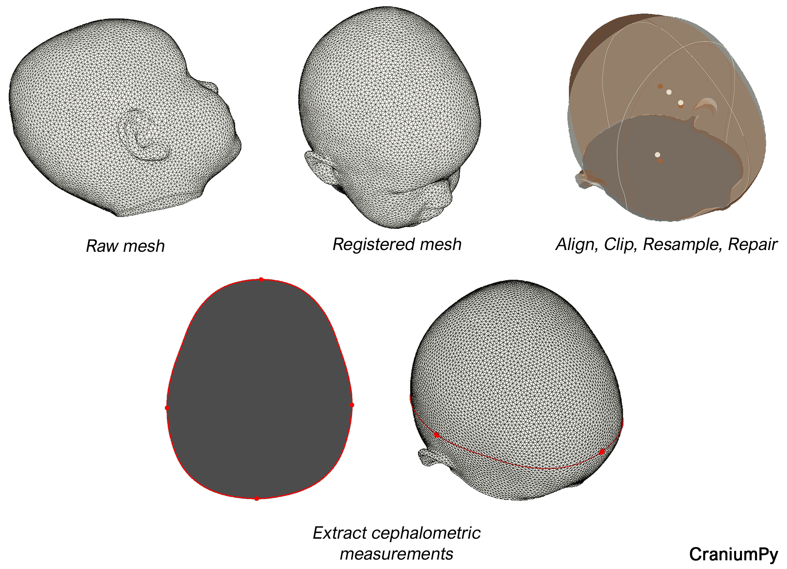

# CraniumPy


  * [Description](#description)
  * [Usage](#usage)
  * [CraniumPy executable](#craniumpy-executable)
  * [Installation](#installation)
  * [Citation](#citation)
  * [Author](#author)


## Description
[](https://doi.org/10.5281/zenodo.6594389)

CraniumPy is a simple tool that can be used to register 3D meshes for cranial analysis using three landmarks. In its current state, a raw 3D mesh (.ply, .obj, .stl) can be imported and visualized. After registration, cephalometric measurements can be automatically extracted. These measurements include:
- occipotofrontal diameter (OFC) / head depth
- biparietal diameter (BPD) / head breadth
- cephalic index (CI) 
- head circumference (HC) 
- mesh volume (can be used for intracranial volume approximation) 



## Usage
Three anatomical landmarks (Nasion, LH tragus, RH tragus) need to be located by the user for registration. The mesh is then registered to an average normal template (https://dined3d.io.tudelft.nl/en/mannequin/tool). 

Based on a single transverse slice (at maximum head depth), cephalometric measurements are automatically extracted and plotted on the 3D model. 

Check the [step-by-step guide](/resources/documentation.pdf) to get started. 

The example mesh ```resources/test_mesh/test_mesh.ply``` can be used to explore the functionality of this tool. 

*NOTE: Step 3. (Clip, Repair, Resample) is computationally heavy (due to the resampling step) and can take a while depending on your setup. Clicking the screen may cause it to freeze.*

## CraniumPy executable
If you want to simply run this tool locally (on Windows) from an executable file (.exe), download the folder _CraniumPy v0.2.2_ from the following link:
[CraniumPy (v0.2.2) Download](https://drive.google.com/drive/folders/1IEGc9CSUtmwWYe6YLG0aSDek_XD9aJEV?usp=sharing).

Simply run the executable file (CraniumPy.exe) to start the program (takes a few seconds to start). You do not need to install any requirements or dependencies. 
The folder contains the templates (for visualizing the registration), step-by-step documentation, and a test_mesh (arbitrary orientation and some artifacts) to experiment with.

## Installation
Project is created with:
* Python version: 3.8

To run this project:
1. Create and/or load a virtual environment (optional):

```
conda create -n yourenvname python=3.8
conda activate yourenvname
```
If you are unfamiliar with virtual environments, check [miniconda](https://docs.conda.io/en/latest/miniconda.html).

2. Clone repository:
```
git clone https://github.com/T-AbdelAlim/CraniumPy.git
cd CraniumPy
```
4. Install requirements:
```
pip install -r requirements.txt
```

5. Run tool:
```
python CraniumPy.py
```

## Building the executebale using pyinstaller
If you are interested in building the executble yourself after you made some changes the code, follow these steps:

1. Install pyinstaller:
```
pip install pyinstaller==4.5.1
```

2. From the CraniumPy main directory run:
```
pyinstaller CraniumPy.py --hidden-import vtkmodules --hidden-import vtkmodules.all --hidden-import vtkmodules.util.numpy_support --hidden-import vtkmodules.numpy_interface --hidden-import vtkmodules.numpy_interface.dataset_adapter --hidden-import vtkmodules.qt --hidden-import vttmodules.util --hidden-import vttmodules.vtkCommonCore --hidden-import vttmodules.vtkCommonKitPython --hidden-import vtkmodules.qt.QVTKRenderWindowInteractor  --onefile --icon=resources/CraniumPy_logo.ico --clean
```

3. Move the executable file (CraniumPy.exe) from ```CraniumPy/dist/CraniumPy.exe``` to the main directory ```CraniumPy/CraniumPy.exe``` and run CraniumPy.exe from here to ensure proper callbacks to templates.

## Known issues

- CraniumPy closes if less than 3 landmarks are selected before registration. Steps need to be follow carefully as described in the step-by-step guide
- Registration step 3. (Clip, Repair, Resample) takes a few seconds and freezes the user interface until all the calculations are performed, which may create the suspicion that the programme crashed ("windows not responding"). This is not the case. The user interface will unfreeze after the calculations are completed and will return the final mesh.


## Citation
If you use this software, I would appreciate if you cite:

```
Abdel-Alim, T. (2021). CraniumPy [Computer software]. https://doi.org/10.5281/zenodo.6594389
```

This code makes use of some excellent features implemented in the PyVista module (https://docs.pyvista.org/). Credit should be given to the original authors: https://joss.theoj.org/papers/10.21105/joss.01450


## Author
Tareq Abdel-Alim (Department of Neurosurgery and Radiology, Erasmus MC, Rotterdam, the Netherlands)

If you have any questions, suggestions, or problems do not hesitate to contact me:
t.abdelalim@erasmusmc.nl
