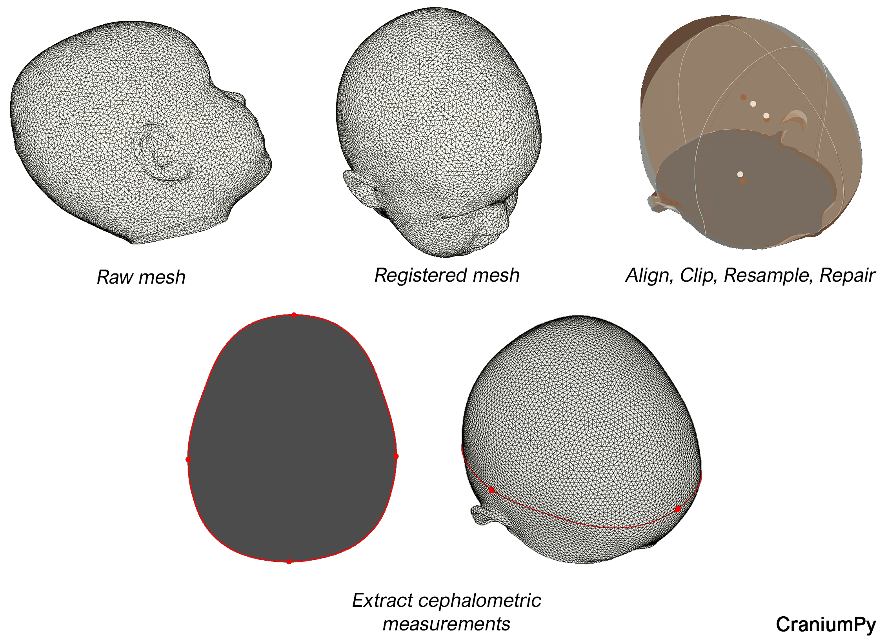
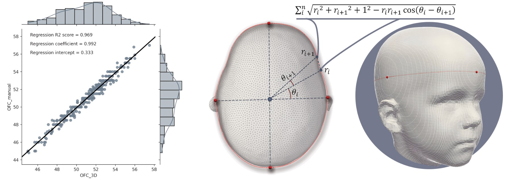

# CranioSuite (built on CraniumPy)

  * [Description](#description)
  * [Download](#download)
  * [Usage](#usage)
    * [Getting started](#getting-started)
    * [Preprocessing and landmarks](#preprocessing-and-landmarks)
    * [Registration and clipping](#registration-and-clipping)
    * [Non-rigid template fitting (NICP)](#non-rigid-template-fitting-nicp)
    * [Visualization](#visualization)
    * [Automated measurement extraction](#automated-measurement-extraction)
    * [Forehead morphology and frontal bossing](#forehead-morphology-and-frontal-bossing)
    * [Asymmetry calculation](#asymmetry-calculation)
    * [Mesh cleanup](#mesh-cleanup)
    * [Patient/visit metadata and reporting](#patientvisit-metadata-and-reporting)
    * [Cohort export and cohort IDs](#cohort-export-and-cohort-ids)
    * [Saving your results](#saving-your-results)
  * [Running it from source](#running-it-from-source)
  * [Known issues](#known-issues)
  * [Citation](#citation)
  * [Author](#author)


## Description
[](https://doi.org/10.5281/zenodo.5634153)

This repository is two things layered on top of each other:

* **CraniumPy** (`src/craniumpy_core`) - the dependency-light processing library: landmark-based registration, repair, clipping, resampling, non-rigid template fitting, and every measurement (cranial cephalometrics, forehead/frontal bossing morphology, facial asymmetry). No UI code lives here.
* **CranioSuite** - the application built on top of that library: the web/desktop UI, the analysis workflow (Data / Preprocessing / Analysis workspaces), and the reporting layer (per-patient PDF/Excel, cohort accumulation with center-local de-identification). This is what `desktop/craniumpy.spec` packages and what the standalone `.exe`/`.app` is titled.

CranioSuite registers and analyzes craniofacial 3D scans (`.ply`, `.obj`, `.stl`): landmark picking, registration, clipping, repair, and resampling, followed by cephalometric measurements, forehead/frontal-bossing shape analysis, or a facial asymmetry score - then reports all of it as a plain-language PDF and a per-patient/cohort Excel spreadsheet.

Runs as a local web app or a standalone desktop app. The legacy PyQt5 version is on the `legacy-craniumpy` branch.

Current capabilities (rigid registration and manual landmarking only, see [Registration and clipping](#registration-and-clipping)):
* Rigid, landmark-based registration, with an optional secondary frontal landmark (e.g. subnasale) for the displayed/saved mesh - picking a 4th landmark automatically switches to the matching shipped template.
* Non-rigid template fitting (NICP) as an optional post-processing step, giving every processed patient the same mesh topology for downstream shape analysis - with a live preview while it fits.
* Template overlay comparison with center-of-gravity offset.
* Mesh repair ([PyMeshFix](https://pymeshfix.pyvista.org/)) and optional resampling to a target vertex count.
* [Validated](http://dx.doi.org/10.1097/SCS.0000000000009448) automated cranial measurements (OFD, BPD, cephalic index, occipitofrontal circumference, mesh volume).
* Forehead morphology and frontal bossing: a bossing angle, a fitted-parabola deviation profile, ridge protrusion/area, temporal hollowing, and a parabolic deviation index.
* Asymmetry scoring for both cranial and facial targets, with an in-viewer colour scale and a side-on companion figure in the saved report.
* Switching between Cranial Vault and Face & Forehead mid-session keeps your landmarks and alignment, and instantly restores whatever scene you'd already built for that target - nothing gets recomputed.
* Patient/visit metadata entry (including a diagnosis field with a craniosynostosis-subtype quick-pick), a plain-language PDF report, and a per-patient/cohort Excel export that tracks the settings each run actually used (center-of-mass correction, NICP template) alongside every measurement - see [Patient/visit metadata and reporting](#patientvisit-metadata-and-reporting). Checkboxes let you choose what to include (measurements/asymmetry/meshes) each time you export.




## Download

The standalone Windows and macOS apps need no Python or dependencies. Get the latest build from the [releases page](https://github.com/T-AbdelAlim/CraniumPy/releases/latest).

* The Windows .exe is unsigned, so SmartScreen or your antivirus may flag it on first run. Click "More info" then "Run anyway".
* The macOS .app is unsigned/unnotarized, so Gatekeeper will refuse to open it normally. Right-click (or Ctrl-click) the app, choose "Open", then confirm in the dialog that appears. Only needed the first time. There are separate builds for Apple Silicon and Intel Macs, so pick the one matching your Mac.
* In the desktop app, "Save results" writes directly next to your original file via a native file picker (see [Saving your results](#saving-your-results)).

For other platforms, or to run from source, see [Running it from source](#running-it-from-source).


## Usage

### Getting started
Upload a mesh, pick 3 landmarks, hit "align", then "run pipeline". `resources/test_mesh/test_mesh_holes.ply` is included to try it out with. It has artificial holes punched into the surface, so you can see how the pipeline's repair step (part of "run pipeline") handles minor scan artifacts. It patches each hole based on the curvature of the surrounding mesh, rather than leaving a gap or capping it flat.

For a textured .obj, select the .obj, its .mtl, and the texture image together. Once a mesh is loaded, a wireframe toggle appears, and a texture toggle if it has a texture.

### Preprocessing and landmarks
Click 3 points on the mesh in this order: sellion, left tragus, right tragus, while holding **Ctrl** (**Cmd** on Mac). Alt+drag a landmark to reposition it.

The sellion is the soft-tissue landmark at the deepest point of the nasal root depression, between the eyes. It approximates the skeletal landmark nasion, which sits underneath it and isn't directly visible on a surface scan. In the 3D photogrammetry literature the two are often used interchangeably, since only sellion is actually clickable on this kind of data.

There is no automatic landmark detection. Landmarks are always picked manually.

For cranial analysis, a checkbox unlocks a 4th, optional landmark (e.g. subnasale). It takes over the registration/clip/display frame for the mesh you see and save, while the actual measurements and the saved 2D figure always stay anchored on sellion. Picking (or clearing) this 4th landmark automatically switches the compare-against template to the matching shipped one - full-head with or without center-of-mass correction to match your own setting.

### Registration and clipping
Once your landmarks are picked, press **"align"**. This is purely the rigid landmark-triangle registration - fast, since nothing else happens yet: no repair, no clip, no center-of-mass correction. The viewer shows the aligned mesh.

**"adjust picks"** puts your landmarks back on screen, now on the aligned mesh instead of the raw scan - often an easier pose to judge a click against. **Alt-drag** a marker to move it, then press "align" again to re-register with the adjustment. The app tracks the rigid transform "align" used, so a drag on the aligned mesh gets converted back to the raw scan's own coordinates before it's stored - "run pipeline" and the saved report always end up describing whatever you most recently adjusted, however many times you've adjusted and re-aligned.

**"reset"** goes back to the raw, unaligned mesh and clears every target's scene for this upload. Changing a landmark or the alt-frontal toggle invalidates the current alignment - you'll need to press "align" again before "run pipeline" unlocks.

Switching between **Cranial Vault** and **Face & Forehead** does not invalidate alignment: your landmarks carry over, and a quick automatic re-registration keeps the preview accurate for whichever target you just switched to. If you'd already run the pipeline for that target earlier in the session, the exact scene you left - mesh, template comparison, everything - comes back instantly instead of being recomputed. Switching to a target you haven't processed yet starts it from the aligned mesh, same as usual.

**"run pipeline"** is the actual committed step: repairs the mesh, clips it to the plane guided by your landmarks (cranial or facial, matching the target you picked - there's no manual clip-plane option right now), resamples if checked, and applies center-of-mass correction if checked - all in one go. The clip boundary is left open, not capped, since repair runs before clipping, so exported meshes may appear open at the cut. Repair is the slow part - it only actually runs on the first "run pipeline" press per mesh; later presses (different vertex count, re-aligned landmarks, toggling center-of-mass correction) reuse that already-repaired mesh instead of re-running it.

"Center-of-mass correction" nudges the head forward/back to compensate for imprecise landmark clicking. It only ever moves the head along its depth axis, never sideways or vertically, and, when the optional 4th landmark is used, the same correction is always derived from the sellion plane so both the sellion measurements and the displayed mesh stay consistent with each other. Recommended for most use-cases, and tracked in every exported report (see [Patient/visit metadata and reporting](#patientvisit-metadata-and-reporting)) so a reader always knows whether it was on.

* **Off**: registration is just the landmark-triangle alignment. The mesh is translated so the centroid of the 3 clicked landmarks lands on the reference frame's origin, nothing more.
* **On** (default): same alignment, plus a single depth-only translation on top, from that initial anchor to the centroid of the head-circumference slice, so the final position reflects the whole head's shape, not just 3 clicked points, giving more consistent comparisons across scans/raters. See [the validation paper](https://journals.lww.com/jcraniofacialsurgery/fulltext/10.1097/scs.0000000000009448~reliability-and-agreement-of-automated-head-measurements) for the full method and reliability data.

### Non-rigid template fitting (NICP)
After "run pipeline" has produced a result, an optional "fit template" step deforms a shipped (or your own custom) template mesh onto the patient's clipped surface using non-rigid iterative closest point. The fitted mesh has the template's own vertex count and connectivity, so every patient fit against the same template ends up with point-to-point correspondence - the prerequisite for cohort-level shape analysis (statistical shape models, dense deformation fields) rather than just the scalar measurements below.

Fitting is deliberately independent of the rest of the analysis: it never touches the reported craniometrics, forehead metrics, or asymmetry index, since a template-deformed mesh describes the template's shape approximating this patient, not the patient's own anatomy those numbers are about. It only ever adds one extra mesh file (`..._N.ply`) alongside the normal result. A live preview shows the fit converging while it runs; the stiffness schedule and correspondence-rejection distance are adjustable in the Preprocessing panel for advanced use, with sensible defaults otherwise. Whether NICP ran, and which template it used, is recorded in every exported report - see [Patient/visit metadata and reporting](#patientvisit-metadata-and-reporting).

### Visualization
After analysis, "Visualization" lets you show either the metrics/asymmetry view or a template comparison over the result mesh, never both at once, since they'd occupy the same space on the viewer.

**Cranial Vault** - **Cranial Measurements** (default): draws the HC circumference ring (red), BPD span (blue), and OFD span (green) on the mesh, the same colours as the saved 2D figure, plus the frontal bossing construction (sellion, the forehead point at the same slice height as the HC ring, and the horizontal reference the angle was measured against). A toggle switches to **Cranial Asymmetry** - see below. The mesh goes semi-transparent while these are showing so a line running along the far side stays visible, and a panel over the viewer shows the numeric values.

**Face & Forehead** - **Forehead Morphology** (default): the fitted-parabola contour, frontal-angle construction, and ridge/temporal region overlays, plus the same frontal bossing construction as above. A toggle switches to **Facial Asymmetry** - see below.

**Asymmetry** (either target): tints the mesh with the same blue(dented in)/white/red(protruding out) heatmap as the saved 2D figure, with a colour scale bar over the viewer. The saved report additionally includes a second, side-on companion figure of the same heatmap.

Every measurement and graph in the Analysis panel has a hover (?) icon explaining what it is and how it's derived - the forehead-morphology profile graphs additionally shade the ridge/temple windows each number above is actually computed from, and show a dashed reference curve for the fitted-parabola comparison every deviation-based number is measured against (see [Forehead morphology and frontal bossing](#forehead-morphology-and-frontal-bossing)).

**Template alignment**: displays a semi-transparent reference template over the result, with axes and center-of-gravity markers for both meshes. Hidden automatically once a NICP fit exists, since the fitted mesh is the more informative comparison at that point.

The "Compare against" dropdown selects a shipped template or a custom file, always shown exactly as stored on disk (no live clipping to match your own mesh). Shipped templates: a clipped cranium reference (with and without center-of-mass correction), a subnasale-landmark full-head reference (with and without center-of-mass correction), and a face reference. The default selection matches your own settings automatically: the subnasale full-head reference if you used the secondary frontal landmark, the clipped cranium reference otherwise, both picking the center-of-mass variant to match your own "center-of-mass correction" checkbox - and re-picked automatically if you change either setting after the fact. In the desktop app, custom template paths are remembered per target (cranial/facial). In the web app, they are not.

### Automated measurement extraction
From a cranially-registered mesh:
* Occipitofrontal diameter (OFD)
* Biparietal diameter (BPD)
* Cephalic index (CI)
* Occipitofrontal circumference (OFC)
* Mesh volume above the landmark plane



Validated for pediatric heads only. Hard-coded sanity bounds apply (see `src/craniumpy_core/craniometrics.py`).

### Forehead morphology and frontal bossing
Computed for both cranial and facial targets, from the same head-circumference slice height a cranial run on the same patient would use (reconstructed in the facial frame when needed, so the two always describe the same physical plane):

* **Frontal bossing angle** - the angle, in the sagittal plane through sellion, between horizontal and the vector to the forehead point at the same slice height used for the head-circumference measurement, so the two numbers are read off a matching physical plane. A smaller angle reads as a more prominent, forward-projecting forehead; larger reads as flatter/receding. Computed once, at the same stage as the cranial measurements, and carried into whichever frame is displayed (including a secondary frontal landmark's frame) without being re-derived, so the drawn construction never disagrees with the reported number.
* **Forehead contour analysis** - a parabola robustly fitted to the lateral portions ("shoulders") of the 2D forehead contour - specifically fit to this patient's own contour, not to a healthy-head template - from which a frontal angle, forehead width, midline curvature concentration, midline ridge protrusion/area (signed: positive means the center sticks out past the parabola, negative means it falls short of it), per-side temporal hollowing and maximum temporal depth, and an overall parabolic deviation index are derived. Because the reference parabola comes from this same forehead's own flanks rather than a population norm, deviation from it is best read as "how localized to the center this is relative to the rest of this forehead," not "how abnormal this forehead is" outright - see [Known issues](#known-issues). See `src/craniumpy_core/metopic.py` for the closed-form definitions.

These forehead metrics are new, reproducible definitions with a reference implementation, not yet validated against a clinical severity score - see [Known issues](#known-issues).

### Asymmetry calculation
Mirrors a registered mesh across the midline and measures per-vertex distance to the mirrored surface, producing a heatmap (mm) and a mean asymmetry index - computed the same way for both targets (a cranial asymmetry index, shown top-down, and a facial asymmetry index, shown frontally). The viewer shows a colour scale bar alongside the heatmap; the saved figures have their own, plus a second, side-on companion figure.

The heatmap and the index describe opposite halves by default, a quirk carried over from the original algorithm (see `src/craniumpy_core/asymmetry.py`).

### Mesh cleanup
Resampling to a target vertex count (optional, default 10000) is one part of what "run pipeline" does - see [Registration and clipping](#registration-and-clipping) above for the rest (repair, clip, center-of-mass correction). The measurement algorithm was validated at 10000 vertices.

### Patient/visit metadata and reporting
A form in the sidebar collects patient/visit fields before you export: patient ID, diagnosis, sex, imaging date, age at imaging, treatment, age at surgery, and one free-text variable - all optional, left blank if not filled in. Diagnosis is a plain text field by default (type anything - useful beyond craniosynostosis), with a quick-pick dropdown alongside it for the common craniosynostosis subtypes, "Syndromic" (which prompts you to type the syndrome name right after), and "Unknown". File name and path are captured automatically from whatever you loaded.

Three checkboxes above "export analysis" - **measurements**, **asymmetry**, **meshes** - choose what actually gets written, all ticked by default. Unticking one leaves that section out of the report/PDF/spreadsheet entirely (not just hidden), or skips the mesh files.

Exporting analysis produces, alongside the meshes (whichever of these are ticked above):
* A machine-readable **JSON report**, with the registered landmarks, every computed measurement, and a `settings` block recording exactly what this run used - target, landmark count, center-of-mass correction, and whether/which NICP template was fit.
* A **per-patient Excel spreadsheet** (`..._summary_cranial.xlsx` or `..._summary_frontal.xlsx`), one formatted row: the patient/visit fields, the same settings as the JSON report (as readable yes/no and template-name columns, not a dumped settings blob), and every measurement - numeric columns are real numbers (so Excel can sort/filter/average them directly), laid out as a proper Excel table with a frozen, filterable header.
* A multi-page **PDF report** (`..._report_cranial.pdf` or `..._report_frontal.pdf`), vector-based so figures and text stay sharp at any zoom, pairing each measurement with a one-line plain-language explanation, asymmetry always last regardless of target - meant to be printed and handed to parents during a visit.

The report/summary/PDF filenames end in `_cranial` or `_frontal` depending on which target you ran, so exporting both for the same patient doesn't overwrite one with the other.

### Cohort export and cohort IDs
Desktop app only. Alongside the per-patient files, you can point "export analysis" at a cohort Excel file to accumulate rows across sessions, meant to eventually be **shared across centers** for pooled analysis. Re-exporting the same source file updates its existing row instead of duplicating it.

Every distinct file exported into a cohort file is assigned a short, sequential **cohort ID** (`C00001`, `C00002`, ...), stable across re-exports of the same file. The cohort spreadsheet carries this ID instead of the patient ID you typed into the metadata form - that locally meaningful identifier (an MRN, a local study number) never leaves this file. The mapping between cohort ID and patient ID is written to a **separate, local-only file** next to the cohort spreadsheet (`{cohort file}_id_mapping.xlsx`) - only that companion file should be treated as sensitive and kept off anything you share onward; the cohort file itself is the one meant to travel.

### Saving your results
Desktop app: "Save results" writes a `CP_{name}_{C|F}_{3|4}[_CoM]/` folder next to the original file, containing the registered mesh, the final mesh (plus a third, NICP-fitted mesh if you used "fit template"), a JSON report, the measurement figure(s), the per-patient Excel summary, and the PDF report. `C`/`F` is cranial/facial, `3`/`4` is how many landmarks were used, and `_CoM` is only appended if center-of-mass correction was on, so two runs with different settings on the same file land in different folders instead of overwriting each other.

Web app: the same folder is downloaded as a zip. Cohort accumulation (see above) is desktop-only - a browser download is a one-shot file with nowhere persistent to append a second export to.

Filenames are shortened: a dotted sub-segment (e.g. `1016510_20210730.000112_edited`) is truncated at the first dot (`1016510_20210730_edited`). The original filename is preserved in the report.


## Running it from source

Requires Python 3.11+.

```
git clone https://github.com/T-AbdelAlim/CraniumPy.git
cd CraniumPy
python -m venv .venv
.venv\Scripts\Activate.ps1      # windows/powershell. bash: source .venv/Scripts/activate. mac/linux: source .venv/bin/activate
pip install -e .
```

The frontend is a Vite/React project under `frontend/` - build it once (requires Node.js) before running either the web app or the desktop app, since both serve the built output, not the source:
```
npm --prefix frontend ci
npm --prefix frontend run build
```
Re-run `npm --prefix frontend run build` after any frontend source change. For live iteration with hot reload instead, run `npm run dev` inside `frontend/` alongside a running backend (see below) - Vite's dev server proxies `/api/*` to it.

Web app:
```
python -m uvicorn api.main:app --port 8734
```
Open `http://127.0.0.1:8734`.

Desktop app:
```
pip install -e ".[desktop]"
python -m desktop.app
```

The standalone Windows .exe is built from this same code via `desktop/craniumpy.spec` and PyInstaller (run `npm run build` in `frontend/` first - the spec bundles `frontend/dist`, not the source tree). The macOS .app is built via `desktop/craniumpy_mac.spec`, same command, run on an actual Mac (PyInstaller can't cross-compile, see `.github/workflows/build-macos.yml` for the CI build, which builds the frontend first automatically).


## Known issues

* Mesh volume requires a watertight mesh. Since the final mesh is intentionally left open at the clip boundary, volume is computed from a temporary capped copy. It reports 0 if that copy cannot be made watertight.
* Resampling uses quadric decimation, not Voronoi/ACVD clustering (see `DEPENDENCIES.md`). Vertex distribution differs from the original app.
* No automatic landmark detection.
* Every per-side ("left"/"right") label in the forehead-morphology and facial-asymmetry output follows the sign of the frame's own x-axis as implemented (x<0 = left) - the shipped reference triangle places the left tragus at *positive* x, so these labels currently read as the anatomical opposite of what they say. Magnitudes and the overall indices are unaffected; only which side a per-side number is attributed to. Worth fixing in code - flagged here so it isn't silently relied on until then.
* The forehead-morphology measurements (frontal angle, ridge protrusion/area, temporal hollowing, parabolic deviation index) are reproducible, closed-form definitions with a reference implementation, but have not yet been validated against a clinical severity score or an independent measurement of the same quantity - treat them as internally comparable, not yet clinically interpretable.
* The "ideal parabola" every forehead deviation-based number is measured against is fit to this same patient's own forehead (the lateral "shoulders", specifically), not to a healthy-population reference - see [Forehead morphology and frontal bossing](#forehead-morphology-and-frontal-bossing). That makes every one of those numbers self-referential: if the condition being measured also affects the shoulders the parabola is fit to, not just the center, the reference inherits that distortion too, and the reported deviation understates it. How much that matters for any given condition - i.e. how confined it actually stays to the center - isn't something this app can answer without real scans to check against.

## Citation
Kindly consider citing the software if it supports your research:

**Initial Publication:**

_Abdel-Alim et al. Sagittal Craniosynostosis: Comparing Surgical Techniques using 3D Photogrammetry. Plastic and Reconstructive Surgery ():10.1097/PRS.0000000000010441, March 22, 2023. | DOI: [10.1097/PRS.0000000000010441](http://dx.doi.org/10.1097/PRS.0000000000010441)_

**Validation Study:**

_Abdel-Alim et al. Reliability and Agreement of Automated Head Measurements From 3-Dimensional Photogrammetry in Young Children. The Journal of Craniofacial Surgery 34(6):p 1629-1634, September 2023. | DOI: [10.1097/SCS.0000000000009448](http://dx.doi.org/10.1097/SCS.0000000000009448)_

**Github Repository:**
```
Abdel-Alim, T. (2022). CraniumPy [Computer software]. https://doi.org/10.5281/zenodo.5634153
```


## Author
Tareq Abdel-Alim | Departments of Neurosurgery and Radiology, Erasmus MC, Rotterdam, the Netherlands

If you have any questions, suggestions, or problems do not hesitate to contact me:
t.abdelalim@erasmusmc.nl
