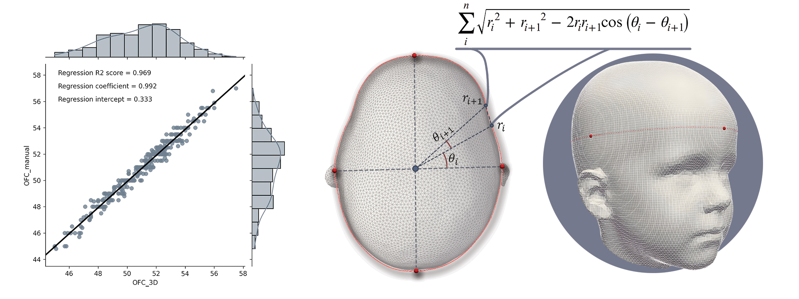

# CraniumPy


  * [Description](#description)
  * [Usage](#usage)
    * [Getting started](#getting-started)
    * [Rigid registration and mesh harmonization ](#rigid-registration-and-mesh-harmonization )
    * [Automated measurement extraction](#automated-measurement-extraction)
    * [Facial asymmetry calculation](#facial-asymmetry-calculation)
    * [Non-rigid ICP](#non-rigid-icp)
  * [Download CraniumPy (.exe)](#download-craniumpy)
  * [Clone repository (without NICP)](#clone-repository-without-NICP)
  * [Clone repository (with NICP)](#clone-repository-with-NICP)
  * [Citation](#citation)
  * [Author](#author)


## Description
[](https://doi.org/10.5281/zenodo.5634153)

CraniumPy is a user-friendly tool developed for the registration and craniofacial analysis of 3D images (.ply, .obj, .stl). It can serve as an end-to-end pipeline, transforming a raw 3D image into a harmonized mesh, ready for either cranial or facial analysis. The integrated pipeline incorporates:

- Rigid and non-rigid registration.
- Voronoi-based clustering for mesh resampling.
- Artifact detection and repair [algorithms](http://dx.doi.org/10.1007/s00371-010-0416-3).
- A [validated algorithm](http://dx.doi.org/10.1097/SCS.0000000000009448) to automatically extract commonly used head measurements.
- Functionality to quantify facial asymmetry.

_This repository makes use of some excellent features implemented in the PyVista library (https://docs.pyvista.org/) and PyMeshFix (https://pymeshfix.pyvista.org/)._


## Usage
### Getting started
Refer to the [step-by-step guide](/resources/documentation.pdf) to get started. 

### Rigid registration and mesh harmonization 
Mesh registration and harmonization in CraniumPy requires three steps:
1. **_Landmark selection_**: Three anatomical landmarks (Nasion, LH tragus, RH tragus) need to be located by the user for registration. 

2.  **_Register for cranial/facial analysis_**: The mesh is rigidly aligned to an average normal template by computing the Euler angles between two sets of vectors (derived from placed landmarks). The registered mesh (_filename_rg.ply_) and the landmark coordinate positions (_filename_landmarks.json_) are stored in place.

3. **_"Clip, Repair, Resample"_**: In the final pre-processing step, the mesh is clipped through a reference plane (cranial analysis: through nasion-tragus plane | facial analysis: through centroid of triangle formed by the 3 landmarks). The clipped mesh is then inspected and artifacts are automatically repaired. Finally, the mesh is resampled to ensure a predefined number of vertices (default: _n= 10.000_).

Based on a single transverse slice (at maximum head depth), cephalometric measurements are automatically extracted and plotted on the 3D model.

The example mesh ```resources/test_mesh/test_mesh.ply``` can be used to explore the functionality of this tool. 

*NOTE: Step 3. (Clip, Repair, Resample) is computationally heavy (due to the resampling step) and can take a while depending on your setup. Clicking the screen may cause it to freeze.*


### Automated measurement extraction
From a mesh that is pre-processed for cranial analysis, several cephalometric measurements can be extracted. These include:
- Occipitofrontal diameter (OFD) or head depth
- Biparietal diameter (BPD) or head breadth
- Cephalic index (CI)
- Occipitofrontal circumference (OFC) or head circumference
- Mesh volume above the nasion-tragus plane (for potential intracranial volume approximation).

 This algorithm is located under the tab _**Compute>Cephalometrics**_. The axial slice from which these measurements have been obtained can also be plotted separately using _**Compute>2D slice**_.



_NOTE: CraniumPy has been optimized for pediatric analysis. For this reason, some hard-coded boundary conditions are established in the extraction algorithm [(e.g. code line 95)](./craniometrics/craniometrics.py). If CraniumPy does not work as desired for your research application (e.g. prematures or adults), feel free to contact me to see if we can find a solution._


### Facial asymmetry calculation
A mesh registered for facial analysis can be used to compute the mean distance between each vertex on one half of the face to its corresponding vertex on the other half (using a mirrored reflection). The output is a heatmap (in mm), showing which areas are more or less symmetric. A quantitative metric is also computed, the mean facial asymmetry (MFA) index, which encapsulates the overall asymmetry observed in the face. This algorithm is located under the tab _**compute>Evaluate Asymmetry**_.

### Non-rigid ICP
A non-rigid iterative closest point (NICP) algorithm has been implemented which tries to deform a template onto the user's input mesh. This feature can come in handy when there's a need for point-to-point correspondence (e.g. automated landmark detection, advanced shape analysis, geometric deep learning). This step allows a user to match the topology of a mesh or set of meshes to that of the template. The mesh quality may be (slightly) reduced after NICP. To run the CraniumPy source code **with** the NICP algorithm, several dependencies need to be installed as described in section [Clone Repository (with NICP)](#clone-repository-with-NICP).


## Download CraniumPy
If you want to run CraniumPy locally (on Windows) follow the steps below. You do not need to install any requirements or dependencies.

1. Download the latest version: [CraniumPy (v0.4.2)](https://drive.google.com/drive/folders/1ilAXTINd2TuKbOsuQLmsuLVTppJMYOxz)
2. Extract the .zip folder in any location

    _The extracted folder contains the templates (for visualizing the registration) and an example mesh is provided at `test_mesh/test_mesh.ply` for experimentation._

3. Run **_CraniumPy_v0.4.2.exe_** (give it a few seconds to load)


IMPORTANT: the reference frame has been changed from v0.3.0 onwards. The new convention is based on the more commonly used right hand coordinate system in which the z-axis points 
outward from the nose. 


## Clone repository (without NICP)
Project is created with:
* Python version: 3.8

To run this project:
1. Create and/or load a virtual environment:

```
conda create -n CraniumPy python=3.8
conda activate CraniumPy
```
If you are unfamiliar with virtual environments, check [miniconda](https://docs.conda.io/en/latest/miniconda.html).

2. Clone repository:
```
git clone https://github.com/T-AbdelAlim/CraniumPy.git
cd CraniumPy
```
3. Install requirements:
```
pip install -r requirements.txt
```

4. Run CraniumPy:
```
python CraniumPy.py
```
## Clone repository (with NICP)
If you want NICP functionality, clone the CraniumPy_NICP branch and follow the steps described above with the following changes:
1. Create and/or load a virtual environment:

```
conda create -n CraniumPy_NICP python=3.8
conda activate CraniumPy_NICP
```
If you are unfamiliar with virtual environments, check [miniconda](https://docs.conda.io/en/latest/miniconda.html).

2. Clone repository:
```
git clone https://github.com/T-AbdelAlim/CraniumPy_NICP.git
cd CraniumPy_NICP
```
3. Install requirements:
```
pip install -r requirements.txt
```

4. Install NICP dependencies (tested on Windows 10 with Anaconda 3 and Python 3.8)
    - `conda install -c conda-forge cython` - tested with v0.29.32
    - `conda install -c conda-forge suitesparse` - tested with v5.4.0
    - optional (included in the build dependencies of `scikit-sparse`):
        - `conda install -c conda-forge numpy` - tested with v1.23.2
        - `conda install -c conda-forge scipy` - tested with v1.9.1
5. Download Microsoft Build Tools for C++ from https://visualstudio.microsoft.com/visual-cpp-build-tools/ (tested with 2022, should work with 2015 or newer)
6. Install Visual Studio Build Tools
    1. Choose Workloads
    2. Check "Desktop development with C++"
    3. Keep standard settings
7. Run in a Powershell
    - `$env:SUITESPARSE_INCLUDE_DIR='.../anaconda3/envs/CraniumPy_NICP/Library/include/suitesparse'`
    - `$env:SUITESPARSE_LIBRARY_DIR='.../anaconda3//envs/CraniumPy_NICP/Library/lib'`
    - `pip install scikit-sparse`
8. Test `from sksparse.cholmod import cholesky`

9. Run CraniumPy:
```
python CraniumPy.py
```

## Known issues

- CraniumPy closes if less than 3 landmarks are selected before registration. Steps need to be followed carefully as described in the step-by-step guide
- Registration step 3. (Clip, Repair, Resample) takes a few seconds and freezes the user interface until all the calculations are performed, which may create the suspicion that the programme crashed ("windows not responding"). This is not the case. The user interface will unfreeze after the calculations are completed and will return the final mesh.


## Citation
Kindly consider citing the software if it supports your research:

**Initial Publication:**

_Abdel-Alim et al. - Sagittal Craniosynostosis: Comparing Surgical Techniques using 3D Photogrammetry. Plastic and Reconstructive Surgery ():10.1097/PRS.0000000000010441, March 22, 2023. | DOI: [10.1097/PRS.0000000000010441](http://dx.doi.org/10.1097/PRS.0000000000010441)_

**Validation Study:** 

_Abdel-Alim et al. - Reliability and Agreement of Automated Head Measurements From 3-Dimensional Photogrammetry in Young Children. The Journal of Craniofacial Surgery 34(6):p 1629-1634, September 2023. | DOI: [10.1097/SCS.0000000000009448](http://dx.doi.org/10.1097/SCS.0000000000009448)_

**Github Repository:**
```
Abdel-Alim, T. (2022). CraniumPy [Computer software]. https://doi.org/10.5281/zenodo.5634153
```


## Author
Tareq Abdel-Alim | Departments of Neurosurgery and Radiology, Erasmus MC, Rotterdam, the Netherlands

If you have any questions, suggestions, or problems do not hesitate to contact me:
t.abdelalim@erasmusmc.nl

